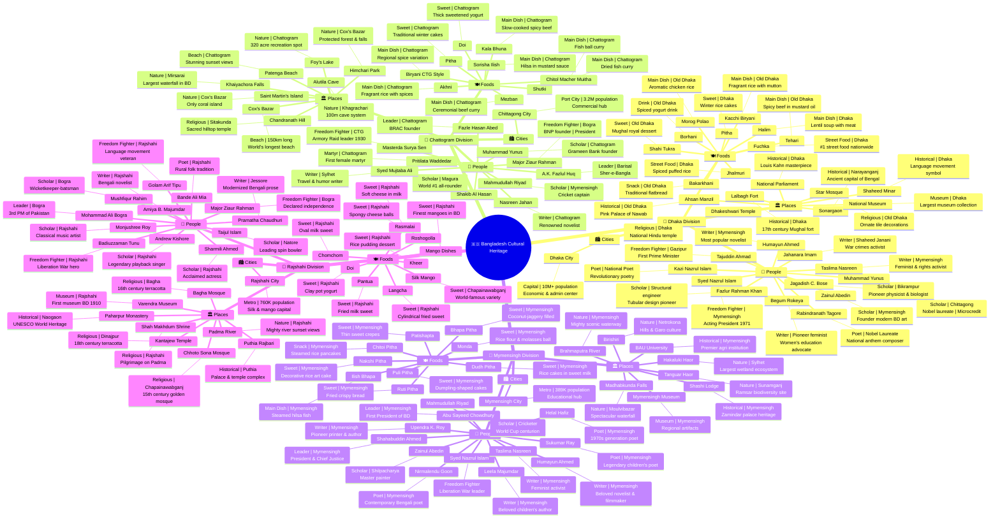

```mermaid
%%{init: {'theme':'dark','themeVariables':{'darkMode':true,'background':'#020617','primaryColor':'#020617','primaryBorderColor':'#22d3ee','primaryTextColor':'#e5e7eb','secondaryColor':'#020617','tertiaryColor':'#020617','lineColor':'#38bdf8','fontFamily':'"Segoe UI", "Noto Sans", sans-serif','fontSize':'13px'},'mindmap':{'padding':24,'nodeSpacing':70,'useMaxWidth':true,'maxNodeWidth':260}}}%%
mindmap
	root((🇧🇩 Bangladesh Cultural Heritage))
		📍 Dhaka Division
			🏙️ Cities
				Dhaka City
					Capital | 10M+ population<br/>Economic & admin center
			🍽️ Foods
				Kacchi Biryani
					Main Dish | Old Dhaka<br/>Fragrant rice with mutton
				Morog Polao
					Main Dish | Old Dhaka<br/>Aromatic chicken rice
				Tehari
					Main Dish | Old Dhaka<br/>Spicy beef in mustard oil
				Bakarkhani
					Snack | Old Dhaka<br/>Traditional flatbread
				Fuchka
					Street Food | Dhaka<br/>#1 street food nationwide
				Halim
					Main Dish | Dhaka<br/>Lentil soup with meat
				Jhalmuri
					Street Food | Dhaka<br/>Spiced puffed rice
				Pitha
					Sweet | Dhaka<br/>Winter rice cakes
				Borhani
					Drink | Old Dhaka<br/>Spiced yogurt drink
				Shahi Tukra
					Sweet | Old Dhaka<br/>Mughal royal dessert
			🏛️ Places
				Lalbagh Fort
					Historical | Dhaka<br/>17th century Mughal fort
				Ahsan Manzil
					Historical | Old Dhaka<br/>Pink Palace of Nawab
				National Parliament
					Historical | Dhaka<br/>Louis Kahn masterpiece
				Shaheed Minar
					Historical | Dhaka<br/>Language movement symbol
				Star Mosque
					Religious | Old Dhaka<br/>Ornate tile decorations
				Dhakeshwari Temple
					Religious | Dhaka<br/>National Hindu temple
				Sonargaon
					Historical | Narayanganj<br/>Ancient capital of Bengal
				National Museum
					Museum | Dhaka<br/>Largest museum collection
			👤 People
				Kazi Nazrul Islam
					Poet | National Poet<br/>Revolutionary poetry
				Begum Rokeya
					Writer | Pioneer feminist<br/>Women's education advocate
				Zainul Abedin
					Scholar | Mymensingh<br/>Founder modern BD art
				Rabindranath Tagore
					Poet | Nobel Laureate<br/>National anthem composer
				Syed Nazrul Islam
					Freedom Fighter | Mymensingh<br/>Acting President 1971
				Tajuddin Ahmad
					Freedom Fighter | Gazipur<br/>First Prime Minister
				Humayun Ahmed
					Writer | Mymensingh<br/>Most popular novelist
				Jahanara Imam
					Writer | Shaheed Janani<br/>War crimes activist
				Fazlur Rahman Khan
					Scholar | Structural engineer<br/>Tubular design pioneer
				Jagadish C. Bose
					Scholar | Bikrampur<br/>Pioneer physicist & biologist
				Muhammad Yunus
					Scholar | Chittagong<br/>Nobel laureate | Microcredit
				Taslima Nasreen
					Writer | Mymensingh<br/>Feminist & rights activist
		📍 Chattogram Division
			🏙️ Cities
				Chittagong City
					Port City | 3.2M population<br/>Commercial hub
			🍽️ Foods
				Mezban
					Main Dish | Chattogram<br/>Ceremonial beef curry
				Shutki
					Main Dish | Chattogram<br/>Dried fish curry
				Kala Bhuna
					Main Dish | Chattogram<br/>Slow-cooked spicy beef
				Akhni
					Main Dish | Chattogram<br/>Fragrant rice with spices
				Chitol Macher Muitha
					Main Dish | Chattogram<br/>Fish ball curry
				Sorisha Ilish
					Main Dish | Chattogram<br/>Hilsa in mustard sauce
				Biryani CTG Style
					Main Dish | Chattogram<br/>Regional spice variation
				Doi
					Sweet | Chattogram<br/>Thick sweetened yogurt
				Pitha
					Sweet | Chattogram<br/>Traditional winter cakes
			🏛️ Places
				Cox's Bazar
					Beach | 150km long<br/>World's longest beach
				Saint Martin's Island
					Nature | Cox's Bazar<br/>Only coral island
				Patenga Beach
					Beach | Chattogram<br/>Stunning sunset views
				Foy's Lake
					Nature | Chattogram<br/>320 acre recreation spot
				Himchari Park
					Nature | Cox's Bazar<br/>Protected forest & falls
				Khaiyachora Falls
					Nature | Mirsarai<br/>Largest waterfall in BD
				Chandranath Hill
					Religious | Sitakunda<br/>Sacred hilltop temple
				Alutila Cave
					Nature | Khagrachari<br/>100m cave system
			👤 People
				Fazle Hasan Abed
					Leader | Chattogram<br/>BRAC founder
				Muhammad Yunus
					Scholar | Chattogram<br/>Grameen Bank founder
				A.K. Fazlul Huq
					Leader | Barisal<br/>Sher-e-Bangla
				Masterda Surya Sen
					Freedom Fighter | CTG<br/>Armory Raid leader 1930
				Pritilata Waddedar
					Martyr | Chattogram<br/>First female martyr
				Major Ziaur Rahman
					Freedom Fighter | Bogra<br/>BNP founder | President
				Mahmudullah Riyad
					Scholar | Mymensingh<br/>Cricket captain
				Shakib Al Hasan
					Scholar | Magura<br/>World #1 all-rounder
				Nasreen Jahan
					Writer | Chattogram<br/>Renowned novelist
				Syed Mujtaba Ali
					Writer | Sylhet<br/>Travel & humor writer
		📍 Mymensingh Division
			🏙️ Cities
				Mymensingh City
					Metro | 389K population<br/>Educational hub
			🍽️ Foods
				Monda
					Sweet | Mymensingh<br/>Rice flour & molasses ball
				Nakshi Pitha
					Sweet | Mymensingh<br/>Decorative rice art cake
				Chitoi Pitha
					Snack | Mymensingh<br/>Steamed rice pancakes
				Bhapa Pitha
					Sweet | Mymensingh<br/>Coconut-jaggery filled
				Patishapta
					Sweet | Mymensingh<br/>Thin sweet crepes
				Ruti Pitha
					Sweet | Mymensingh<br/>Fried crispy bread
				Puli Pitha
					Sweet | Mymensingh<br/>Dumpling-shaped cakes
				Dudh Pitha
					Sweet | Mymensingh<br/>Rice cakes in sweet milk
				Ilish Bhapa
					Main Dish | Mymensingh<br/>Steamed hilsa fish
			🏛️ Places
				Brahmaputra River
					Nature | Mymensingh<br/>Mighty scenic waterway
				Shashi Lodge
					Historical | Mymensingh<br/>Zamindar palace heritage
				Mymensingh Museum
					Museum | Mymensingh<br/>Regional artifacts
				BAU University
					Historical | Mymensingh<br/>Premier agri institution
				Birishiri
					Nature | Netrokona<br/>Hills & Garo culture
				Madhabkunda Falls
					Nature | Moulvibazar<br/>Spectacular waterfall
				Hakaluki Haor
					Nature | Sylhet<br/>Largest wetland ecosystem
				Tanguar Haor
					Nature | Sunamganj<br/>Ramsar biodiversity site
			👤 People
				Zainul Abedin
					Scholar | Shilpacharya<br/>Master painter
				Humayun Ahmed
					Writer | Mymensingh<br/>Beloved novelist & filmmaker
				Syed Nazrul Islam
					Freedom Fighter<br/>Liberation War leader
				Abu Sayeed Chowdhury
					Leader | Mymensingh<br/>First President of BD
				Shahabuddin Ahmed
					Leader | Mymensingh<br/>President & Chief Justice
				Upendra K. Roy
					Writer | Mymensingh<br/>Pioneer printer & author
				Sukumar Ray
					Poet | Mymensingh<br/>Legendary children's poet
				Leela Majumdar
					Writer | Mymensingh<br/>Beloved children's author
				Nirmalendu Goon
					Poet | Mymensingh<br/>Contemporary Bengali poet
				Helal Hafiz
					Poet | Mymensingh<br/>1970s generation poet
				Taslima Nasreen
					Writer | Mymensingh<br/>Feminist activist
				Mahmudullah Riyad
					Scholar | Cricketer<br/>World Cup centurion
		📍 Rajshahi Division
			🏙️ Cities
				Rajshahi City
					Metro | 760K population<br/>Silk & mango capital
			🍽️ Foods
				Mango Dishes
					Sweet | Rajshahi<br/>Finest mangoes in BD
				Chomchom
					Sweet | Rajshahi<br/>Oval milk sweet
				Roshogolla
					Sweet | Rajshahi<br/>Spongy cheese balls
				Rasmalai
					Sweet | Rajshahi<br/>Soft cheese in milk
				Kheer
					Sweet | Rajshahi<br/>Rice pudding dessert
				Doi
					Sweet | Rajshahi<br/>Clay pot yogurt
				Pantua
					Sweet | Rajshahi<br/>Fried milk sweet
				Silk Mango
					Sweet | Chapainawabganj<br/>World-famous variety
				Langcha
					Sweet | Rajshahi<br/>Cylindrical fried sweet
			🏛️ Places
				Varendra Museum
					Museum | Rajshahi<br/>First museum BD 1910
				Puthia Rajbari
					Historical | Puthia<br/>Palace & temple complex
				Bagha Mosque
					Religious | Bagha<br/>16th century terracotta
				Shah Makhdum Shrine
					Religious | Rajshahi<br/>Pilgrimage on Padma
				Padma River
					Nature | Rajshahi<br/>Mighty river sunset views
				Paharpur Monastery
					Historical | Naogaon<br/>UNESCO World Heritage
				Kantajew Temple
					Religious | Dinajpur<br/>18th century terracotta
				Chhoto Sona Mosque
					Religious | Chapainawabganj<br/>15th century golden mosque
			👤 People
				Major Ziaur Rahman
					Freedom Fighter | Bogra<br/>Declared independence
				Mohammad Ali Bogra
					Leader | Bogra<br/>3rd PM of Pakistan
				Pramatha Chaudhuri
					Writer | Jessore<br/>Modernized Bengali prose
				Mushfiqur Rahim
					Scholar | Bogra<br/>Wicketkeeper-batsman
				Taijul Islam
					Scholar | Natore<br/>Leading spin bowler
				Badiuzzaman Tunu
					Freedom Fighter | Rajshahi<br/>Liberation War hero
				Golam Arif Tipu
					Freedom Fighter | Rajshahi<br/>Language movement veteran
				Bande Ali Mia
					Poet | Rajshahi<br/>Rural folk tradition
				Amiya B. Majumdar
					Writer | Rajshahi<br/>Bengali novelist
				Andrew Kishore
					Scholar | Rajshahi<br/>Legendary playback singer
				Sharmili Ahmed
					Scholar | Rajshahi<br/>Acclaimed actress
				Monjushree Roy
					Scholar | Rajshahi<br/>Classical music artist
```
